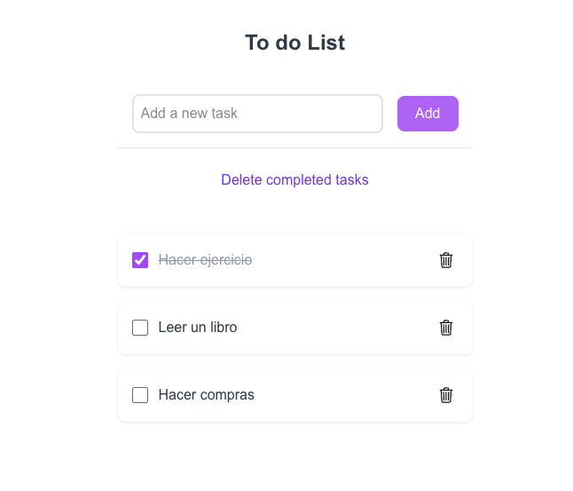
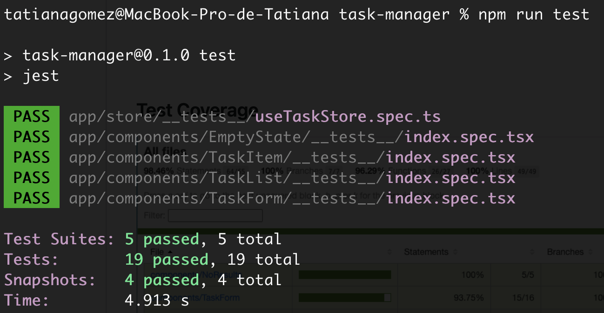
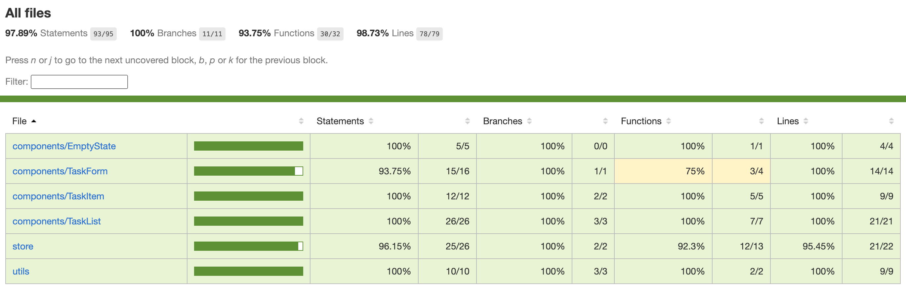

# Task Manager App

A task management module built with **React** (Next.js + TypeScript) that allows users to add, list, mark as completed, and delete tasks. It features state management with Zustand, and unit tests

---

## 🚀 Description

This project is a task management module where you can:
- Add new tasks.
- List all tasks.
- Mark tasks as completed.
- Delete individual tasks or all completed tasks.
- See an illustrated empty state when there are no tasks.

---

## 🛠️ Technologies & Decisions

- **Framework:** [Next.js](https://nextjs.org/) (React + TypeScript)
- **State Management:** [Zustand](https://zustand-demo.pmnd.rs/)
- **Styling:** CSS Modules for encapsulation and consistency.
- **Testing:** [Jest](https://jestjs.io/) + [@testing-library/react](https://testing-library.com/docs/react-testing-library/intro/)
- **Modularization:** Small, reusable components (`TaskForm`, `TaskList`, `TaskItem`, `EmptyState`).
- **SOLID:** Separation of logic, presentation, and state.
- **Compatibility:** Special configuration so tests work with Turbopack and Babel.

---

## 📦 Installation & Usage

1. **Clone the repository:**
   ```bash
   git clone https://github.com/ktatianna/task-manager.git
   cd task-manager-app
   ```

2. **Install dependencies:**
   ```bash
   npm install
   ```

3. **Run the development server:**
   ```bash
   npm run dev
   ```
   Open [http://localhost:3000](http://localhost:3000) in your browser.

4. **Run the tests:**
   ```bash
   npm run test
   ```

---

## 🧪 Testing Evidence

- Tests cover:
  - Adding tasks
  - Deleting tasks
  - Marking as completed
  - UI rendering and empty state
- All tests pass successfully (`npm run test`).

---

## 📊 Test Coverage

You can generate a coverage report with:

```bash
npm run test -- --coverage
```

Sample summary:

```
------------------|---------|----------|---------|---------|-------------------
File              | % Stmts | % Branch | % Funcs | % Lines | Uncovered Line #s 
------------------|---------|----------|---------|---------|-------------------
All files         |   98.46 |      100 |   96.29 |     100 |                   
 ...nts/NoResults |     100 |      100 |     100 |     100 |                   
  index.tsx       |     100 |      100 |     100 |     100 |                   
 ...ents/TaskForm |   93.75 |      100 |      75 |     100 |                   
  index.tsx       |   93.75 |      100 |      75 |     100 |                   
 ...ents/TaskItem |     100 |      100 |     100 |     100 |                   
  index.tsx       |     100 |      100 |     100 |     100 |                   
 ...ents/TaskList |     100 |      100 |     100 |     100 |                   
  index.tsx       |     100 |      100 |     100 |     100 |                   
 store            |     100 |      100 |     100 |     100 |                   
  useTaskStore.ts |     100 |      100 |     100 |     100 |                   
------------------|---------|----------|---------|---------|-------------------
```

## 🖼️ Screenshots

### Main UI


### Empty State


### Tests


### Test Coverage
